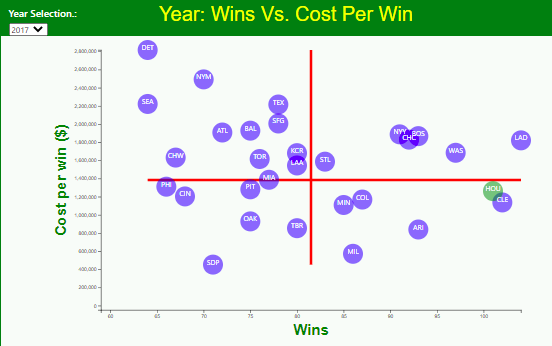

# 
 

## <b>
Moneyball? Who gets the most bang for their buck?
</b>

### Background:
Major League Baseball is the only league of the four major sports not to employ a hard salary cap. The lack of spending restrictions results in a 
culture of "haves" and "have nots." Teams in larger media markets, like New York and Los Angeles, have almost unlimited resources to devote to signing and 
acquiring baseball's best, and most expensive talents.

In 1998, the Oakland Athletics, a classic "have not" franchise, hired a little-known, former utility player named Billy Beane as general manager. 
Under some of the tightest spending constraints, Oakland was struggling to compete with the New York Yankees, Boston Red Sox and other "haves." Beane and 
his lieutenants eschewed longheld baseball wisdom that emphasized players who hit for high average, knocked in a lot of runs (RBI) and stole a lot of bases. 
Players who compiled these types of stats, commanded large salaries. 

Instead Oakland utilized an emerging set of analytics called sabermetrics which placed importance on stats like on base percentage and slugging percentage. 
As these stats weren't traditionally regarded as important, players who excelled in these areas generally commanded lower salaries.

As a result of this revolutionary approach, which became known as "Moneyball, Oakland has consistently competed with teams that spend as much as six times
more money on players salaries. This phenomenon was the subject of the 2003 book *"Moneyball: The Art of Winning an Unfair Game,"* by Michael Lewis; as well as 
a 2011 feature film starring Brad Pitt and Jonah Hill.

This project provides a cursory glance at "Moneyball" and whether Beane and the Athletics organization were successful in getting "bang for their buck." 
Additionally, users can use our database to explore their favorite team's spending and win trends over the last 20 years. 

### Process: 
- [x] Concept design and project planning.
- [x] Create Github Repository.
- [x] Evaluate and obtain data sources.
- [x] Create databases to archive data.
  - [x] Create SQL database
  - [x] Create SQL lite database
  
- [x] Develop a Python Flask application to create API's enabling users to explore data. 
- [x] Generate a website with instructions for users to access API's and website content.
- [x] Design additional web pages containing analysis, charts, interactive experiences, and data allowing users to investigate correlations between team salaries and outcomes.

### Resources:
-	HTML/CSS
-	JavaScript
-	JavaScript library
	-	[ECMAScript Internationalization API](https://402.ecma-international.org/1.0/) 		
-	Python
-	SQL
-	SQL lite

	

### Data Sources:
	
   1. [Kaggle:Baseball Databank](https://www.kaggle.com/open-source-sports/baseball-databank?select=HallOfFame.csv)
      
   Baseball Databank is a compilation of historical baseball data in aconvenient, tidy format, distributed under Open Data terms.
   This version of the Baseball databank was downloaded from [Sean Lahman's website](http://www.seanlahman.com/baseball-archive/statistics/). Data sets employed were:
      +  [Teams.csv](https://www.kaggle.com/open-source-sports/baseball-databank?select=Teams.csv) (537 KB, Total columns available: 48)
      +  [Saleries.csv](https://www.kaggle.com/open-source-sports/baseball-databank?select=Salaries.csv) (756 KB, Total columns available: 5)
        		
	

	
	
	
   2. [USA Today: MLB Team Salaries](https://www.usatoday.com/sports/mlb/salaries/2019/team/all/)
      
   USA TODAY's baseball salaries database contains year-by-year listings of salaries for Major League Baseball players on opening day rosters and disabled lists, 1988 	through the current season. Figures, compiled by USA TODAY, are based on documents obtained from the MLB Players Association, club officials and filed with Major League Baseball's central office. Deferred payments and incentive clauses are not included. Team payrolls do not include money paid or received in trades or for players who have been released. Average and median salaries reported by USA TODAY may differ from numbers that are reported elsewhere.
      
   
   3. [Baseball Reference: Major League Baseball Team Win Totals](https://www.baseball-reference.com/leagues/MLB/index.shtml)
  Baseball Reference is widely conidered the authoritative source for professional baseball statistics and data from more than 120 years of baseball history. We utilized BBREF's
yearly baseball win totals collection to assemble our win data.
   

### Charts: 
-	Interactive charts providing opportunity to analyze individual team's cost-per-win.
-	Scatterplot representing cost per win for all 30 teams annually from 2000-2019. 

	
### Analysis:

#### Wins
Over the 20-year period we examined, the Athletics won 1,729 regular season games – an average of 86.5 per season. The average MLB team over those two decades registered just 82 wins.

#### Cost per Win
The Athletics’ cost per win (total team salary expenditures/team wins) came out to $686,427. At first glance one would say wins are expensive. Consider though that average cost per win leaguewide during this period was $1,122,739. In short, the Athletics spent 31 percent less to win about 4.5 more games per season as compared to the rest of the league.
When considering the disadvantages the Athletics franchise faces, objectively, it’s not unreasonable to conclude that the Moneyball approach has been a success over its two decades of implementation.

									
[Sample Web](https://money-ball-demo-web.herokuapp.com/)

